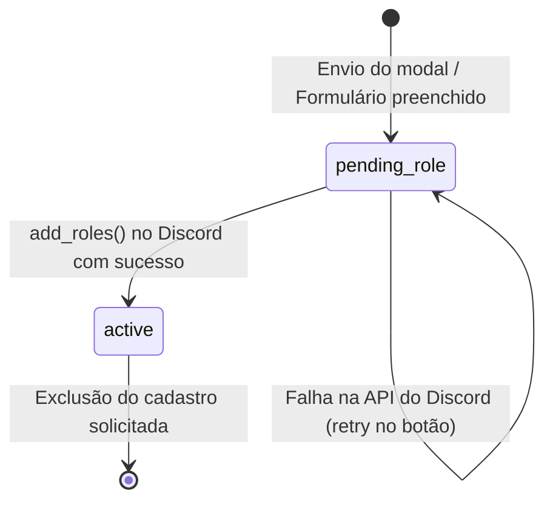
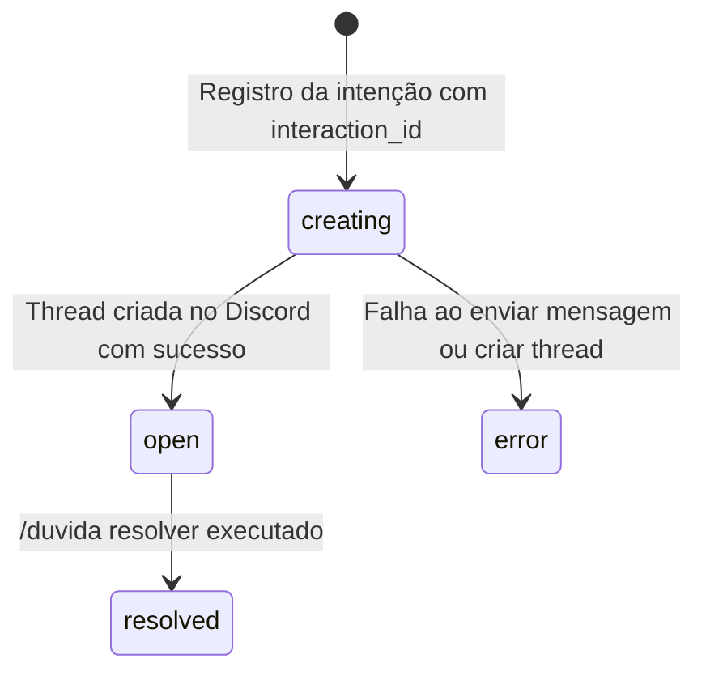

# Documentação do Banco de Dados e Ciclo de Dados

Este documento descreve o modelo relacional do SQLite, as máquinas de estado das entidades, as garantias de atomicidade e os procedimentos de privacidade e reconciliação de dados.

---

## 1. Configurações Globais do SQLite

Todas as conexões assíncronas gerenciadas pelo bot aplicam os seguintes `PRAGMAs` obrigatórios:

```sql
PRAGMA foreign_keys = ON;
PRAGMA journal_mode = WAL;
PRAGMA busy_timeout = 5000;
```

- `foreign_keys = ON`: Garante a integridade referencial com deleções em cascata (`ON DELETE CASCADE`).
- `journal_mode = WAL`: Habilita o *Write-Ahead Logging*, permitindo leituras simultâneas sem bloqueio de escritores e alta performance.
- `busy_timeout = 5000`: Aguarda até 5 segundos caso o banco esteja ocupado antes de gerar um erro de lock.
- `PRAGMA user_version`: Armazena a versão atual do schema (iniciando em `1`), garantindo inicialização e migrações estruturadas e idempotentes.

---

## 2. Tabelas e Índices

### 2.1. `guild_settings`
Armazena a configuração operacional de cada servidor Discord associado ao bot.

| Coluna | Tipo | Descrição |
| :--- | :--- | :--- |
| `guild_id` | `TEXT PRIMARY KEY` | ID do servidor no Discord. |
| `welcome_channel_id` | `TEXT NOT NULL` | Canal de entrada / boas-vindas / cadastro. |
| `doubts_channel_id` | `TEXT NOT NULL` | Canal onde as dúvidas e tópicos são abertos. |
| `queue_channel_id` | `TEXT NOT NULL` | Canal onde as chamadas da fila são anunciadas. |
| `student_role_id` | `TEXT NOT NULL` | Cargo Aluno atribuído no cadastro. |
| `monitor_role_id` | `TEXT NOT NULL` | Cargo Monitor para permissões de atendimento. |
| `welcome_message_id` | `TEXT` | ID da mensagem fixa com botão persistente. |
| `office_hours_text` | `TEXT NOT NULL` | Texto com horários da monitoria. |
| `timezone` | `TEXT NOT NULL` | Fuso horário de referência (`America/Sao_Paulo`). |
| `created_at` / `updated_at`| `TEXT NOT NULL` | Timestamps em formato ISO 8601 UTC. |

### 2.2. `students`
Armazena os dados autodeclarados dos alunos cadastrados.

| Coluna | Tipo | Descrição |
| :--- | :--- | :--- |
| `guild_id` | `TEXT NOT NULL` | Servidor ao qual o cadastro pertence (FK -> `guild_settings`). |
| `user_id` | `TEXT NOT NULL` | ID da conta do aluno no Discord. |
| `full_name` | `TEXT NOT NULL` | Nome completo (1 a 100 caracteres). |
| `ra` | `TEXT NOT NULL` | RA com zeros à esquerda preservados (1 a 32 caracteres). |
| `class_name` | `TEXT` | Turma opcional (até 80 caracteres). |
| `status` | `TEXT NOT NULL` | Estado do cadastro: `'pending_role'` ou `'active'`. |
| `created_at` / `updated_at`| `TEXT NOT NULL` | Timestamps em formato ISO 8601 UTC. |

**Restrições e Índices:**
- `PRIMARY KEY (guild_id, user_id)`: Um aluno possui no máximo um cadastro por servidor.
- `UNIQUE (guild_id, ra)`: Um mesmo RA não pode ser cadastrado por duas contas no mesmo servidor.
- É perfeitamente permitido que o mesmo RA exista em servidores distintos (`multi-tenant` seguro).

### 2.3. `doubts`
Registra o ciclo de vida das dúvidas publicadas e os vínculos com mensagens e tópicos (threads) do Discord.

| Coluna | Tipo | Descrição |
| :--- | :--- | :--- |
| `id` | `INTEGER PRIMARY KEY` | Identificador sequencial da dúvida. |
| `guild_id` | `TEXT NOT NULL` | ID do servidor (FK -> `guild_settings`). |
| `author_user_id` | `TEXT NOT NULL` | ID do aluno autor no Discord. |
| `interaction_id` | `TEXT NOT NULL UNIQUE` | ID da interação slash do Discord (idempotência). |
| `subject` / `title` / `description` | `TEXT NOT NULL` | Conteúdo da dúvida (nunca inclui RA). |
| `channel_id` | `TEXT NOT NULL` | Canal onde a mensagem foi enviada. |
| `message_id` / `thread_id` | `TEXT UNIQUE` | IDs da mensagem e da thread gerada. |
| `status` | `TEXT NOT NULL` | `'creating'`, `'open'`, `'resolved'` ou `'error'`. |
| `resolved_by_user_id` | `TEXT` | ID do usuário que encerrou a dúvida. |
| `resolved_at` | `TEXT` | Timestamp UTC da resolução. |

**Índices:**
- `idx_doubts_author` em `(guild_id, author_user_id, status)` para agilizar `/duvida minhas`.

### 2.4. `queue_entries`
Controla a fila de atendimento individual síncrono.

| Coluna | Tipo | Descrição |
| :--- | :--- | :--- |
| `id` | `INTEGER PRIMARY KEY` | Identificador sequencial da entrada. |
| `guild_id` | `TEXT NOT NULL` | ID do servidor (FK -> `guild_settings`). |
| `user_id` | `TEXT NOT NULL` | ID do aluno no Discord. |
| `subject` | `TEXT NOT NULL` | Tópico que o aluno deseja tirar dúvida. |
| `status` | `TEXT NOT NULL` | `'waiting'`, `'serving'`, `'completed'`, `'cancelled'`. |
| `called_by_user_id` | `TEXT` | ID do monitor que atendeu. |
| `created_at` / `called_at` / `finished_at` | `TEXT` | Timestamps em UTC. |

**Índices Críticos:**
- `idx_queue_one_active_per_student`: Garante que um aluno tenha apenas 1 entrada com status `waiting` ou `serving` por guilda.
- `idx_queue_one_serving_per_guild`: Garante que no máximo 1 aluno esteja com status `serving` simultaneamente na guilda.
- `idx_queue_fifo`: Otimiza a ordenação FIFO por `created_at ASC, id ASC`.

### 2.5. `materials` e `material_tags`
Repositório de links para materiais de apoio.

- `materials`: `(id, guild_id, title, description, url, created_by_user_id, created_at)`
- `material_tags`: `(material_id, tag) PRIMARY KEY` com `ON DELETE CASCADE` e índice em `tag`.

---

## 3. Máquinas de Estado e Reconciliação

### 3.1. Máquina de Estado do Aluno



**Recuperação de Cadastro Pendente:**
Se o bot falhar ao atribuir o cargo no Discord (por exemplo, hierarquia incorreta do cargo do bot ou instabilidade passageira da API), o registro é preservado como `pending_role`. O aluno não precisa preencher o formulário novamente: basta clicar no botão de cadastro na mensagem fixa. O bot detectará o registro pendente e tentará novamente atribuir o cargo.

### 3.2. Máquina de Estado da Dúvida



**Reconciliação de Dúvidas Interrompidas:**
A gravação preliminar em `creating` com `interaction_id` único assegura que retentativas de um mesmo comando slash não criem dúvidas duplicadas. Caso a criação da thread falhe, a dúvida fica marcada como `error` para fins de auditoria, e o aluno recebe uma mensagem clara explicando a falha.

---

## 4. Procedimentos de Privacidade e Exclusão de Dados

### 4.1. Coleta e Finalidade do RA
O Registro Acadêmico (RA) é coletado com a finalidade exclusiva de permitir o acompanhamento da frequência e do atendimento pelos monitores e docentes responsáveis pela disciplina de Cálculo 3.

### 4.2. Correção de Dados
O aluno que identificar erro em seu cadastro pode solicitar a alteração diretamente a um monitor. O monitor utilizará o comando privado `/aluno-editar` para atualizar os dados, mantendo a validação de unicidade de RA.

### 4.3. Exclusão de Cadastro a Pedido do Titular
Quando um aluno solicitar a exclusão de seus dados pessoais:
1. O administrador ou monitor executa a deleção no banco de dados:
   ```sql
   DELETE FROM students WHERE guild_id = ? AND user_id = ?;
   ```
2. **Limites Técnicos Importantes:**
   - A exclusão do registro na tabela `students` remove o vínculo do Nome Completo, RA e Turma da base de dados ativa.
   - IDs de mensagens, threads abertas e histórico de mensagens dentro do Discord são geridos pela infraestrutura da Discord Inc. e pelos administradores do servidor.
   - Backups históricos gerados anteriormente preservarão o estado da base naquele momento até que expirem conforme a política de retenção (`retention-days`).
   - Não se deve presumir conformidade legal automática sem o estabelecimento de uma política institucional explícita definida pelo responsável pela disciplina.
